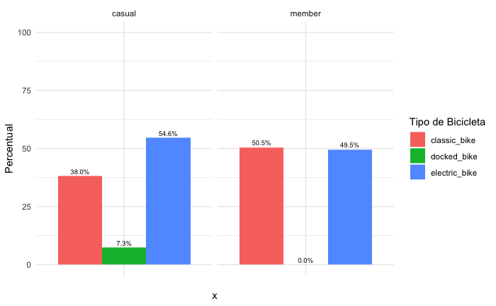
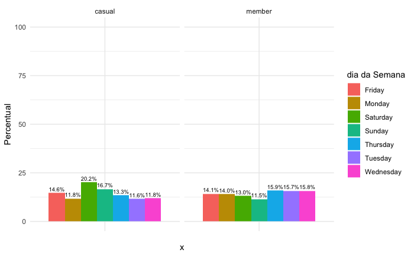
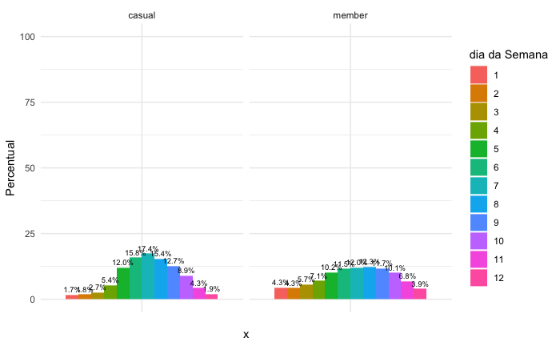
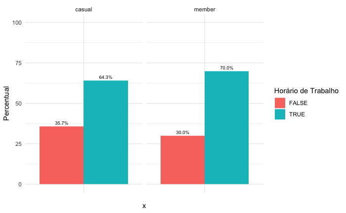

# Resumo da Analise do Caso

## Objetivo 1 - Identificar as diferenças entre os usuários casuais e os membros anuais

### Tipo de Bicicleta

Durante a nossa análise, identificamos que os usuários casuais fazem o uso das bicicletas docked, que são bicicletas que vem acopladas com cadeiras para que mais de uma pessoa possa viajar, como crianças. Isso significa um uso recreativo da bicicleta. No caso dos usuários membros, não houve utilização desse tipo de bicicleta.

Outra ponto identificado foi que os usuários casuais fazem maior uso de bicicletas elétricas, 5% a mais, que os usuários membros.

Todas essas observações podemos verificar no gráfico abaixo

### Utilização por dia de semana

Durante a nossa análise, identificamos que os usuários casuais fazem um maior uso das bicicletas durante os finais de semana, enquanto os membros anuais fazem um maior uso durante a semana.

Todas essas observações podemos verificar no gráfico abaixo

### Utilização por mês

Durante nossa análise, percebemos um uso mais regular durante os meses para os usuários membros, enquanto para os usuários casuais, o uso se intensifica mais durante os meses mais quentes e férias escolares.

Todas essas observações podemos verificar no grárico abaixo

### Utilização durante o horário de trabalho (Entre as 06:00 e 18:00)

Durante nossa análise foi verificado uma pequena diferença de utilização durante o horário de trabalho. Os usuários membros utilizam as bicicletas mais durante o horário de trabalho, enquanto os usuários casuais utilizam mais fora do horário de trabalho, uma diferença de 6%

Todas essas observações podemos verificar no gráfico abaixo

## Objetivo 2 - Identificar possíveis motivos que atraiam os ciclistas casuais a se tornarem membros anuais.

Observando os dados apresentados, podemos inferir que uma parte desses usuários utilizam as bicicletas para lazer. Com isso, uma forma de atração desse público seria a criação de um plano anual focado no lazer, no uso para esse fim das bicicletas, esporádicos.

Conforme nós observamos nos gráficos de utilização mensal, há uma demanda muito grande desse público durante os meses mais quentes e de férias muito menor durante os meses mais frios. Convencer esse público a pagar para não usar (já que durante esse período realizar o lazer a uma temperatura muito baixa não é tão convidativo), pode-se fazer um plano onde esses meses sejam mais baratos e nos meses de alta demanda sejam preços melhores, tornando assim o plano mais atrativo

## Objetivo 3 - Identificar formas de usar mídias digitais para influenciar os passageiros casuais a se tornarem membros anuais.

Pela nossa análise, com esses dados que temos, os usuários médios casuáis são usuários para lazer que gostam de pedalar em família. Como os dados apresentados não tem a idade, sexo, não é possível direcinar a qual público. Mas é possível saber que esse público tem como gosto pedalar como forma de lazer.
O que se pode fazer é o uso de redes sociais, filtrar por gosto de pedalar, focando nos moradores de Chicago, e realizar uma propaganda direcionada a eles. 
